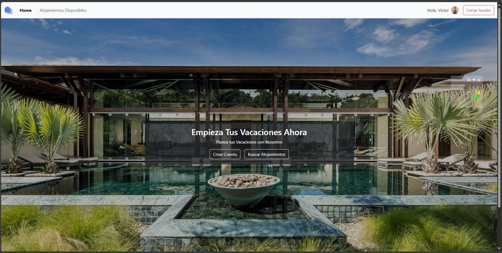

# 🏡 Home Away

**Home Away** es una plataforma web para la gestión de alojamientos temporales, que conecta a los huéspedes con los propietarios de alojamientos. El proyecto fue desarrollado como parte del grupo **SC502-3C2024-Grupo3** y utiliza tecnologías como **HTML**, **CSS**, **JavaScript** y **PHP** para las APIs. La aplicación permite a los usuarios registrarse, gestionar sus alojamientos y realizar reservas.

---

## ✨ Funcionalidades Principales

- Registro y autenticación de usuarios con roles diferenciados (huésped y propietario)
- Creación, edición y eliminación de publicaciones de alojamientos
- Sistema de roles para control de acceso y seguridad
- Filtros avanzados para buscar alojamientos según preferencias
- **Nuevas funcionalidades de reservas**, donde los huéspedes pueden realizar reservas en los alojamientos disponibles
- Interfaz web responsive para dispositivos móviles
- **Almacenamiento de imágenes y archivos en el servidor**, sin sobrecargar la base de datos

---

## 📸 Vista previa del proyecto

### Página principal


### Filtro de búsqueda


### Vista de todos los alojamientos


### Funcinalidad de reservaciones


---

## 🛠️ Tecnologías utilizadas

- **HTML** para la estructura de la página
- **CSS** para el diseño y estilos
- **JavaScript** para la interacción en el cliente
- **PHP** para el backend y las APIs
- **MySQL** para la base de datos
- **Firebase Storage** para almacenamiento de imágenes y archivos multimedia

---

## ⚡ Cómo ejecutar el proyecto

```bash
# Clonar el repositorio
git clone https://github.com/tu-usuario/SC502-3C2024-Grupo3.git
cd SC502-3C2024-Grupo3

# Asegúrate de tener un servidor local con PHP, como XAMPP o WAMP, y MySQL configurados.
# Coloca los archivos en el directorio adecuado de tu servidor local (htdocs en XAMPP).
# Abre el navegador y accede a http://localhost/SC502-3C2024-Grupo3
